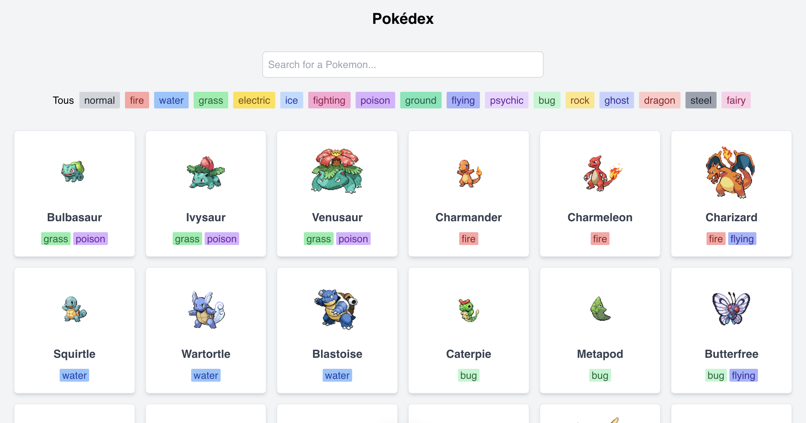

# Alpine Pokedex

Alpine Pokedex is a 

**Demo: [alpine-pokedex.vercel.app](https://alpine-pokedex.vercel.app)**



## Features

- **API Integration:** The application uses the [PokeAPI](https://pokeapi.co) API to fetch pokemon data.
- **Search:** Search for a Pokemon by name.
- **Filter:** Filter Pokemon list by type.
- **Local Storage:** Filters and search query are stored in the local storage.
- **Responsive Design**: The application is responsive and works on all devices.

## Tech Stack


- **Framework**: [Alpine.js](https://alpinejs.dev)
- **Styling**: [Tailwind CSS](https://tailwindcss.com)
- **API:** [PokeAPI](https://pokeapi.co)
- **Deployment**: [Vercel](https://vercel.com)

## Getting Started

To get started with this project, follow these steps:

1. **Clone the repository**:
    ```sh
    git clone https://github.com/zorkham/alpine-pokedex.git
    ```

2. **Open in your browser**: Open the HTML file in your default browser to see the application in action.

## Other Projects

- [Alpine Markt](https://github.com/Zorkham/alpine-markt)
- [Alpine Password Manager](https://github.com/Zorkham/alpine-password-manager)
- [Alpine Board Game Explorer](https://github.com/Zorkham/alpine-board-game-explorer)
